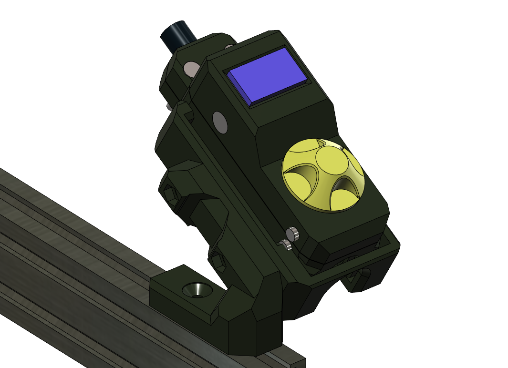
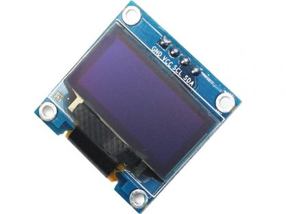
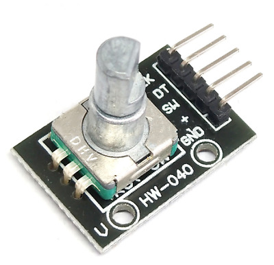
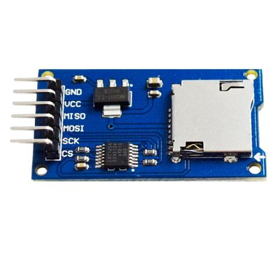
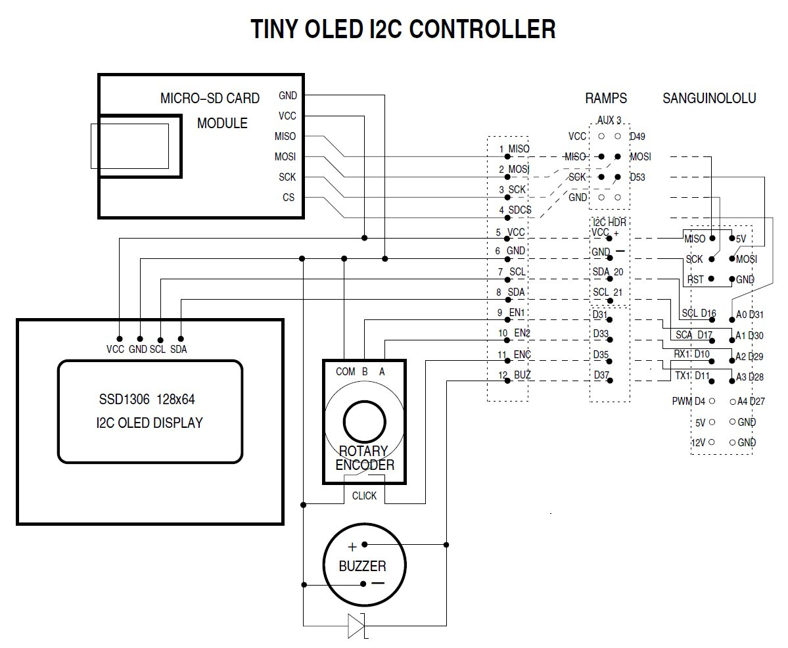

# miniOlED 
## _3D printer controller based on  0.96" OLED screen with encoder and sd card reader_




Project is based on [Reprap Forum thread], where i found inspiration and connection diagram to make my own screen.

I found necessary components that does not require soldering and made ergonomic housing for easy control of 3d printer.

## BOM

- OLED 0.96" i2c screen

- Encoder module

- SD Card reader module (SPI)

- M3x12 6pcs
- M2x20 4pcs
- M2x12 4pcs
- M2.5x8 2pcs
- M3x16 2pcs
- OD 10mm cable chain (optional)


Printed parts (any material of choice, PETG recommended):


| Used as | STL name |
| ------ | ------ |
| Base; | _oled-lcd-screen-base.stl_ |
| Upper cover; |  _oled-lcd-screen-cable-box-upper.stl_ |
| Lower cover; | _oled-lcd-screen-cable-cover.stl_ |
| Internal link; |  _oled-lcs-screen-addon.stl_ |
| Knob; | _oled-lcd-knob.stl_|


Overall mount directions:
> Base attaches all 3 modules, so assemble them at first
> Lower cover and internal link needs to go second
> Upper cover and cable clamp third
> At last knob is to be press fitted onto encoder shaft


This text you see here is *actually- written in Markdown! To get a feel
for Markdown's syntax, type some text into the left window and
watch the results in the right.


## Firmware changes


Preferable Marlin 2.0.9.1 (tested and working).
Newest Marlin version might require changes.

In file _Configuration.h_ you need to specify:

```sh
#define U8GLIB_SSD1306
// DIY TinyOLED https://reprap.org/forum/read.php?13,499572,page=1
#define TINYOLED
```

Changes in _pins_RAMPS.h_ (changes also should include "cleanup" of unused code loops, for it otherwise might not work):


```sh
#if ENABLED(TINYOLED)
  #define BTN_EN1 33
  #define BTN_EN2 35
  #define BTN_ENC 31
  #define BEEPER_PIN -1
  #define LCD_SDSS 53
  #define SD_DETECT_PIN -1
  #define KILL_PIN -1
#endif
```
Lastly add lines in _Conditionals_LCD.h_:

```sh
   #elif ENABLED(TINYOLED)
     #define DOGLCD
     #define IS_RRD_SC
    //  #define IS_ULTIPANEL 1
     #define IS_U8GLIB_SSD1306
```

firmware is 

## Schematic

Wiring is the same as with TinyOLED:  
  
Curtesy of [Reprap Forum thread]

## Development

Want to contribute? Great!

To do:
> - add internal cutout to upper cover for longer OLED pins
> - make changes to base to ensure ease of printability (supportless if possible)
> - ensure proper dimensional tolerances for M3 screws on the upper, lower covers
> - additional instructions to implement on newer Marlin versions

## License

GPLv3

**Open Source, Hell Yeah!**

[//]: # (REFLINKS)

   [Reprap Forum thread]:<https://reprap.org/forum/read.php?13,499572,page=1>
